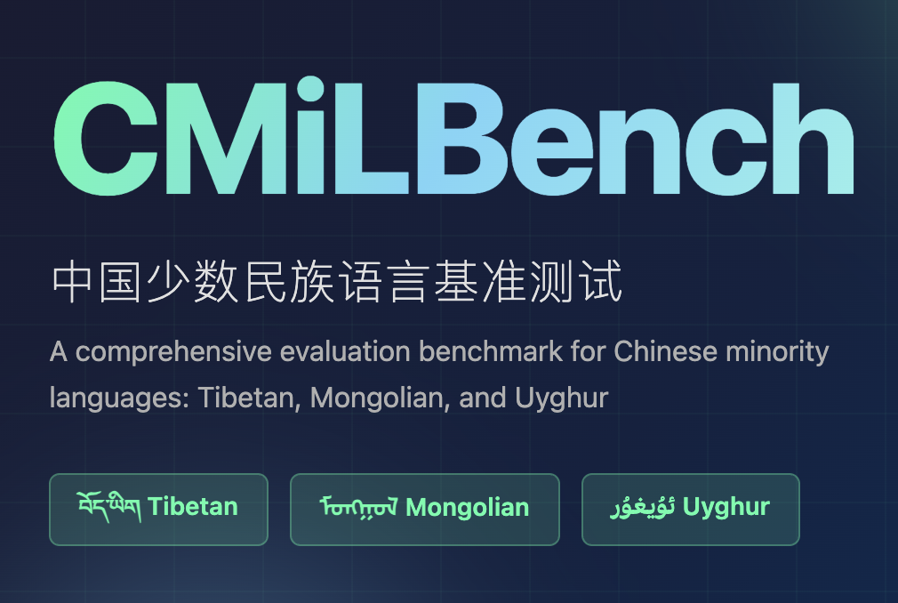

<p align="center">
  <a href="README.md">
    
  </a>
  <a href="README_ZH.md">
    
  </a>
</p>

## Benchmark Introduction

**CMiLBench** is a hierarchical multitask evaluation benchmark specifically designed for Chinese ethnic minority languages (Tibetan `bo`, Mongolian `mn`, Uyghur `ug`). This benchmark aims to systematically evaluate large language models' understanding, generation, and safety alignment capabilities in low-resource language environments.

CMiLBench contains the following three major task categories with a total of 17 subtasks, covering linguistic foundational capabilities, cultural knowledge abilities, and multilingual safety:

- Foundation Tasks
- Chinese Minority Knowledge Tasks
- Safety Alignment Tasks

### Task Distribution Overview


---

## File Structure

```bash
CMiLBench/
├── data/
│   ├── Chinese_Minority_Knowledge_Tasks/
│   │   ├── Minority_Culture_QA/
│   │   ├── Minority_Domain_Competence/
│   │   ├── Minority_Language_Expressions/
│   │   ├── Minority_Language_Instruction_QA/
│   │   ├── Minority_Language_Understanding/
│   │   └── Minority_Machine_Translation/
│   ├── Foundation_Tasks/
│   │   ├── Coreference_Resolution/
│   │   ├── General_Domain_Competence/
│   │   ├── Machine_Reading_Comprehension/
│   │   ├── Math_Reasoning/
│   │   ├── Natural_Language_Inference/
│   │   └── Text_Classification/
│   └── Safety_Alignment_Tasks/
│       ├── Commercial_Compliance_Check/
│       ├── Discrimination_Detection/
│       ├── Rights_Protection_Evaluation/
│       ├── Service_Safety_Evaluation/
│       └── Value_Alignment_Assessment/
├── inference/                    # Inference scripts
│   ├── infer_api.py
│   ├── infer_api.sh
│   ├── infer_vllm.py
│   └── infer_vllm.sh
├── evaluation/                  # Evaluation scripts
│   ├── answer_extraction.py
│   ├── comprehensive_evaluation.py
│   └── llm_evaluation.py.py
└── README.md

```

## 🚀 Quick Start

### Installation

```bash
# 1. Clone the repository
git clone https://github.com/your-repo/CMiLBench.git
cd CMiLBench

# 2. Create conda environment
conda create -n cmilbench python=3.11
conda activate cmilbench
pip install torch==2.6.0 torchvision==0.21.0 torchaudio==2.6.0 --index-url https://download.pytorch.org/whl/cu124

# 3. Install dependencies
pip install -r requirements.txt
```

### Start Evaluation

#### 1. API-based Inference

**Step 1: Configure API Information**

Configure your API key and address in the execution script:

```bash
# Edit inference script
nano inference/infer_api.sh

# Modify the following configuration items (required):
model_name="gpt-4o"                   # Model name you want to use
api_key="your_api_key_here"           # Replace with your actual API key
api_base="https://api.openai.com/v1"  # Replace with your API address
BASE_PATH="/path/to/CMiLBench"        # Modify to actual dataset path
INFER_SCRIPT="/path/to/infer_vllm.py" # Inference script path
```

**Step 2: Execute Inference**

```bash
# Run complete inference (all tasks, all languages)
cd inference
bash infer_api.sh
```

#### 2. Local Model Inference

**Step 1: Configure Model and Dataset Paths**

Configure your local model and dataset paths in the execution script:

```bash
# Edit inference script
nano inference/infer_vllm.sh

# Modify the following configuration items (required):
model_type="qwen"                      # Model type: qwen, aya, llama, mistral, gemma
model_path="/path/to/your/model"       # Replace with your local model path
model_name="gpt-4o"                    # Model name you want to use
BASE_PATH="/path/to/CMiLBench"         # Modify to actual dataset path
INFER_SCRIPT="/path/to/infer_vllm.py"  # Inference script path

# GPU configuration (optional):
export CUDA_VISIBLE_DEVICES=0          # Specify GPU to use
gpu_memory_utilization=0.9             # GPU memory utilization
tensor_parallel_size=1                 # Tensor parallel size
```

**Step 2: Execute Inference**

```bash
# Run complete inference (all tasks, all languages)
cd inference
bash infer_vllm.sh
```

After inference completion, results will be saved in the following directory structure:

```
output/
├── {model_name}/
│   ├── Foundation_Tasks/
│   │   ├── Text_Classification/{lang}/
│   │   ├── Natural_Language_Inference/{lang}/
│   │   └── ...
│   ├── Chinese_Minority_Knowledge_Tasks/
│   │   ├── Minority_Culture_QA/{lang}/
│   │   ├── Minority_Machine_Translation/{lang}/
│   │   └── ...
│   └── Safety_Alignment_Tasks/
│       ├── Commercial_Compliance_Check/{lang}/
│       ├── Discrimination_Detection/{lang}/
│       └── ...
```

Each task result file contains:
- `id`: Sample ID
- `pred`: Model prediction result
- `gold`: Ground truth answer
  
#### 3. Result Evaluation

##### Step 1: Answer Extraction

Perform standardized answer extraction on inference results to prepare for subsequent evaluation:

```bash
# Edit answer extraction script
nano evaluation/answer_extraction.py

# Execute answer extraction
python evaluation/answer_extraction.py \
    --base_path "/path/to/output"              # 📁 Base path of inference results
    --output_dir "/path/to/extracted_answers"  # 📁 Output directory for extracted answers
    --model "gpt-4o"                          # 🎯 Specify model to process (optional, process all if not specified)
    --task "Text_Classification"              # 📋 Specify task to process (optional, process all if not specified)
    --language "bo"                           # 🌐 Specify language to process (optional, process all if not specified)
```

After extraction completion, results will be saved in the following directory structure:

```
output_dir/
├── {model_name}/
│   ├── {task_name}/
│   │   └── {language}/
│   │       └── *.json                    # Processed data files
├── processed_files_map.json              # Processed file mapping table
├── extraction_failed_ids.json            # Failed extraction ID records
├── extraction_statistics.json            # Extraction statistics data
└── extraction_report.txt                 # Readable statistics report
```

##### Step 2: Generative Task Evaluation

Use LLM to perform multi-dimensional quality evaluation for generative tasks (traditional culture QA and text generation):

```bash
# Edit generative task evaluation script
nano evaluation/generative_evaluation.py

# Execute generative task evaluation
python evaluation/generative_evaluation.py \
    --test_data_path "/path/to/CMiLBench"                    # 📁 Test dataset base path
    --models_predictions_path "/path/to/extracted_answers"   # 📁 Model prediction results path (output from step 1)
    --output_path "/path/to/evaluation_results"             # 📁 Evaluation results output path
    --api_key "your_api_key_here"                           # 🔑 OpenAI API key
    --api_base "https://api.openai.com/v1"                  # 🌐 API base URL (optional)
    --model "gpt-4o"                                        # 🤖 LLM model for evaluation
    --max_workers 5                                         # ⚡ Number of parallel processing threads
    --models_to_evaluate "Qwen2.5-7B-Instruct"             # 🎯 Specify models to evaluate (optional)
    --task "text_generation"                                # 📋 Specify task type (optional)
    --language "bo"                                         # 🌐 Specify language (optional)
    --sample_size 100                                       # 📊 Number of evaluation samples (optional, default all)
    --resume                                                # 🔄 Resume from checkpoint (optional)
```

After evaluation completion, results will be saved in the following directory structure:
```
evaluation_results/
├── {model_name}/
│   ├── Minority_Culture_QA/
│   │   ├── bo_evaluation.json
│   │   ├── mn_evaluation.json
│   │   ├── ug_evaluation.json
│   │   ├── bo_checkpoint.json (temporary file)
│   │   ├── bo_errors.log
│   │   └── bo_error_ids.json
│   └── Minority_Language_Instruction_QA/
│       ├── bo_evaluation.json
│       ├── mn_evaluation.json
│       ├── ug_evaluation.json
│       ├── bo_checkpoint.json (temporary file)
│       ├── bo_errors.log
│       └── bo_error_ids.json
```

##### Step 3: Comprehensive Evaluation

Use the comprehensive evaluation script to perform multi-dimensional evaluation for all tasks, calculating accuracy, ROUGE-L, BLEU, chrF++ and other metrics, and generate detailed evaluation reports and model rankings:

```bash
# Edit comprehensive evaluation script
nano evaluation/comprehensive_evaluation.py

# Execute comprehensive evaluation
python evaluation/comprehensive_evaluation.py \
    --input_dir "/path/to/extracted_answers"           # 📁 Answer extraction results directory (output from step 1)
    --output_dir "/path/to/comprehensive_results"      # 📁 Comprehensive evaluation results output directory
    --llm_eval_dir "/path/to/llm_evaluation_results"   # 📁 LLM evaluation results directory (output from step 2, for generative tasks)
    --model "gpt-4o"                                   # 🎯 Specify model to evaluate (optional, evaluate all if not specified)
    --task "Text_Classification"                       # 📋 Specify task directory name to evaluate (optional, evaluate all if not specified)
    --language "bo"                                    # 🌐 Specify language to evaluate (optional, evaluate all if not specified)
```

###### Output Results

After comprehensive evaluation completion, the following files will be generated in the output directory:

```
comprehensive_results/
├── evaluation_summary.csv          # 📊 Detailed evaluation summary table
├── task_ranking.csv               # 🏆 Task-level ranking table
├── model_overall_ranking.csv      # 🥇 Model overall ranking table
└── ranking_report.txt             # 📄 Readable ranking report
```

**📊 `evaluation_summary.csv` - Detailed Evaluation Summary Table**
Contains detailed evaluation results for each model on each task:

| Field | Description |
|------|------|
| Model | Model name |
| Task | Task name |
| Language | Evaluation language |
| File | Result file name |
| Metric | Evaluation metric |
| Score_Type | Score type (all/success) |
| Score | Evaluation score |
| Sample_Count | Total sample count |
| Success_Count | Successfully processed sample count |
| Success_Rate | Success processing rate |

**🏆 `task_ranking.csv` - Task-level Ranking Table**
Model ranking for each task:

| Field | Description |
|------|------|
| Task_Key | Task identifier key |
| Rank | Ranking |
| Model | Model name |
| Metric | Primary evaluation metric |
| Score | Evaluation score |

**🥇 `model_overall_ranking.csv` - Model Overall Ranking Table**
Model comprehensive ranking based on performance across all tasks:

| Field | Description |
|------|------|
| Model | Model name |
| Overall_Rank | Overall ranking |
| Average_Rank | Average ranking |
| Total_Score | Total score |
| Tasks_Evaluated | Number of evaluated tasks |

**📄 `ranking_report.txt` - Readable Ranking Report**
Human-readable ranking report text, including:
- Overall ranking overview
- Detailed rankings for each task
- Model performance analysis

## Data Access

Due to the sensitive nature of the content, the **Safety Alignment Tasks** subset is not publicly released. To request access, please contact us at mucnlp@outlook.com with the following information:

1. Personal and institutional details.
2. Intended usage and purpose of the dataset.

We will evaluate requests on a case-by-case basis and grant access in compliance with the relevant requirements.
